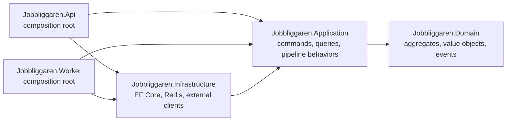
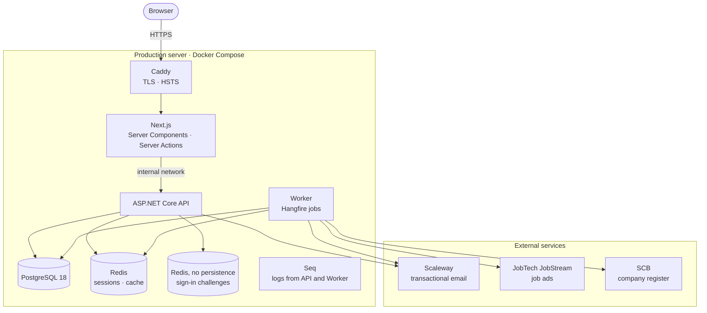
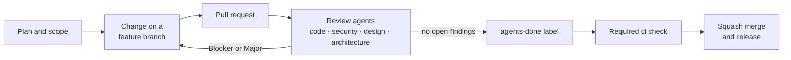

# Jobbliggaren

**A Swedish job-search and application tracker, built as a civic utility.**
Search Platsbanken's job ads, track every application from draft to offer, follow
companies, and get a CV review that cites the text it is judging. The CV review and the
job matching are rule-based and explainable: the product makes no AI or LLM calls.

[](https://github.com/klasolsson81/jobbliggaren/actions/workflows/build.yml)
[](https://dotnet.microsoft.com/)
[](https://nextjs.org/)
[](https://www.typescriptlang.org/)
[](https://www.postgresql.org/)
[](LICENSE)

> [!NOTE]
> **Status: pre-MVP, in early testing with real users at
> [jobbliggaren.se](https://jobbliggaren.se), where registration is open.** Every merge to
> `main` is built, attested and released to a single production server, which applies it
> on its own
> ([ADR 0149](docs/decisions/0149-a-release-is-one-verified-record-the-channel-moves-only-after-the-whole-set-and-the-box-applies-exactly-what-it-names.md),
> [ADR 0154](docs/decisions/0154-one-box-one-domain-every-merged-release-goes-live-on-jobbliggaren-se.md)).
> The user interface is in Swedish. Code and commits are in English, and the documentation
> is partly in Swedish.

## Contents

- [Features](#features)
- [Architecture](#architecture)
- [Quality and CI](#quality-and-ci)
- [How it is built](#how-it-is-built)
- [Tech stack](#tech-stack)
- [Getting started](#getting-started)
- [Common commands](#common-commands)
- [Repository layout](#repository-layout)
- [Security and privacy](#security-and-privacy)
- [Documentation](#documentation)
- [Author and license](#author-and-license)

## Features

| Area | What it does |
|---|---|
| **Job search** (`/jobb`) | Ads from Arbetsförmedlingen's JobTech JobStream API, kept current by a background job. PostgreSQL full-text search with filters for occupation group, region and municipality, remote work, employment type, working hours and employer. Recent searches and saved ads. |
| **Explainable matching** | Each ad gets a named match grade for the user's stated occupations and preferences, with the matched and missing criteria listed per dimension. By design there is no percentage score. |
| **Applications** (`/ansokningar`) | A pipeline with ten statuses, from *Draft* to *Accepted*, *Rejected*, *Withdrawn* or *Ghosted*. Moves between statuses are free, with suggested next steps, and are recorded on an append-only timeline. Follow-ups are logged with channel and outcome. `/statistik` shows a funnel, the rejection rate and monthly volume. A monthly summary helps the user fill in Arbetsförmedlingen's activity report. |
| **Companies** (`/foretag`) | Company search, follows, and watches that combine industry codes (SNI) with municipalities. They run against a local copy of Statistics Sweden's (SCB) company register, which the Worker refreshes on a schedule. |
| **CV review** (`/cv`) | PDF or DOCX upload. A rule engine assesses the CV against a versioned Swedish rubric (`rubric.v2.3.0.json`, 43 criteria). Every verdict cites the span of the CV it is based on, and a personal identity number in the text is flagged. |
| **Accounts** | Passwordless sign-in with a one-time code or link ([ADR 0142](docs/decisions/0142-passwordless-auth-one-page-code-or-link-oauth-ready.md)), optionally via Google, GitHub or LinkedIn. Self-service account deletion with a 30-day restore window. A per-page feedback form, behind a switch that is off by default. |
| **Administration** (`/admin`) | Account directory, suspension and reinstatement, scheduled deletion, address change, audit-log search, background-job monitoring and a feedback inbox. |

Not live today: the CV builder (paused), automatic CV improvement suggestions (the engine
exists, the endpoints were removed) and notifications for saved searches (the backend
model exists, there is no UI for it).

## Architecture

The backend follows Clean Architecture with DDD aggregates and CQRS. The layer rules
are enforced by architecture tests that fail the build, not by convention alone
([ADR 0001](docs/decisions/0001-clean-architecture.md)).



**Runtime.** The production stack is one Docker Compose project on a single server.
The browser reaches only Caddy and Next.js; the API is not exposed at the edge.



### Mechanisms worth reading

**The domain depends on nothing.** `DomainLayerTests` fails the build if the domain
assembly references EF Core, ASP.NET Core, Mediator, FluentValidation or any outer layer:

```csharp
// tests/Jobbliggaren.Architecture.Tests/DomainLayerTests.cs
Types.InAssembly(typeof(Jobbliggaren.Domain.Common.Entity<>).Assembly)
    .ShouldNot()
    .HaveDependencyOnAny(
        "Microsoft.EntityFrameworkCore", "Microsoft.AspNetCore",
        "Mediator", "FluentValidation",
        "Jobbliggaren.Application", "Jobbliggaren.Infrastructure",
        "Jobbliggaren.Api", "Jobbliggaren.Worker")
    .GetResult();
```

The same suite checks that Application references no Infrastructure, ASP.NET Core or
database-provider package, and that aggregates expose no public setters.

**Aggregates guard their invariants.** `Application.TransitionTo` refuses to change a
deleted application, stamps the application date once, and writes each status change to
the timeline in the same unit of work as the status itself:

```csharp
// src/Jobbliggaren.Domain/Applications/Application.cs (abridged)
if (DeletedAt is not null)
    return Result.Failure(DomainError.Validation(
        "Application.DeletedCannotTransition",
        "Det går inte att ändra status på en borttagen ansökan."));
if (target == Status) return Result.Success();
...
if (target == ApplicationStatus.Submitted && AppliedAt is null)
    AppliedAt = now;
RecordStatusChange(previous, target, now);
RaiseDomainEvent(
    new ApplicationStatusTransitionedDomainEvent(Id, JobSeekerId, previous, target, now));
```

**Strongly typed IDs.** Identifiers are `readonly record struct` types such as
`ApplicationId`, so the compiler rejects one aggregate's ID where another's is expected
([ADR 0011](docs/decisions/0011-strongly-typed-ids.md)).

**One pipeline, shared by both hosts.** Cross-cutting concerns are Mediator pipeline
behaviors registered in a fixed order from `MediatorPipelineBehaviors.InOrder`
([ADR 0008](docs/decisions/0008-pipeline-behavior-order.md)): logging scope, logging,
validation, authorization, admin authorization, re-authentication, account-access
mutation, encryption-key prefetch, unit of work, recent-search capture and audit. The
API and the Worker register the same list, and an architecture test pins the order.

**No repository layer.** Handlers use `IAppDbContext` directly
([ADR 0009](docs/decisions/0009-no-repository-pattern.md)); queries that need
provider-specific SQL sit behind ports that Infrastructure implements.

**An anti-corruption layer for the job taxonomy.** JobTech's taxonomy codes are resolved
against a local snapshot behind a port, so the external vocabulary never becomes the
domain's language and search never calls the taxonomy API
([ADR 0043](docs/decisions/0043-taxonomy-acl-for-search-surface.md)).

All architecture decisions are recorded as ADRs in [`docs/decisions/`](docs/decisions/),
indexed in [`docs/decisions/README.md`](docs/decisions/README.md).

## Quality and CI

`main` is protected: every change goes through a pull request, history is linear, and
the single required check is the `ci` aggregate in
[`.github/workflows/build.yml`](.github/workflows/build.yml)
([ADR 0065](docs/decisions/0065-pr-flow-restoration-with-ci-gate.md)). It passes only
when all of these pass:

| Job | What it checks |
|---|---|
| `frontend` | ESLint, a CSS token guard, `tsc --noEmit`, the production build and Vitest |
| `coverage` | Every .NET test project, followed by a per-layer coverage floor |
| `scripts` | Fixture tests for the CI, merge and deployment scripts, plus configuration guards |
| `images` | Docker builds of every deployable image and a Trivy scan |

CodeQL (C# and TypeScript), Playwright end-to-end tests, Lighthouse, a load test and a
dependency audit also run, but only report. Dependabot keeps NuGet, npm and Actions
dependencies current.

**Tests.** Domain and Application logic is tested without a database. Handlers run
against substitutes of `IAppDbContext`, while integration tests use real PostgreSQL and
Redis containers through Testcontainers. On 2026-10-09 the `coverage` job at
[`1f81187`](https://github.com/klasolsson81/jobbliggaren/actions/runs/37938563626) ran
**26,283 backend tests**, and the `frontend` job ran **6,609 Vitest tests**, all passing.
First-party .NET coverage was:

| Assembly | Line | Branch | Gate |
|---|---:|---:|---|
| Jobbliggaren.Domain | 98.0 % | 95.8 % | line ≥ 93, branch ≥ 91 |
| Jobbliggaren.Application | 97.2 % | 93.0 % | line ≥ 95, branch ≥ 89 |
| Jobbliggaren.Infrastructure | 95.4 % | — | line ≥ 82 |
| Jobbliggaren.Api | 94.6 % | — | line ≥ 91 |
| Jobbliggaren.Worker | 72.9 % | — | observe-only |
| **All first-party code** | **96.1 %** | **90.1 %** | |

Generated code, migrations and `Program.cs` are excluded from the measurement. Job logic
lives in Application, so the thin Worker host is reported but not gated. The floors are
regression guards, not targets
([ADR 0044](docs/decisions/0044-test-coverage-policy.md)). Reproduce the report locally
with `bash scripts/coverage.sh`.

## How it is built

Jobbliggaren is written by one developer working with AI coding agents (Claude Code and
Codex) under written rules. [`AGENTS.md`](AGENTS.md) holds the shared conventions and
anti-patterns, and [`CLAUDE.md`](CLAUDE.md) holds the session and review protocol.



- **Review agents with a veto.** Specialised reviewers, defined in
  [`.claude/agents/`](.claude/agents/), check each pull request within their remit.
  Auto-merge is armed only when the `agents-done` label is present, which the session
  sets after every mandatory reviewer has reported with no open Blocker or Major finding.
- **Decisions are recorded.** Architecture decisions become ADRs, and a changed decision
  gets a new ADR or an amendment instead of a silent edit.
- **Every merge is released.** CI-built images are attested, recorded as one release,
  and applied by the server itself
  ([ADR 0149](docs/decisions/0149-a-release-is-one-verified-record-the-channel-moves-only-after-the-whole-set-and-the-box-applies-exactly-what-it-names.md)).

## Tech stack

Major versions are listed here. Exact versions are pinned in
[`Directory.Packages.props`](Directory.Packages.props),
[`global.json`](global.json) and
[`web/jobbliggaren-web/package.json`](web/jobbliggaren-web/package.json).

| Layer | Technology |
|---|---|
| Backend | .NET 10, C# 14, ASP.NET Core Minimal APIs, `Mediator` 3 (source-generated), FluentValidation 12, Ardalis.SmartEnum |
| Persistence | EF Core 10 with Npgsql, PostgreSQL 18, ASP.NET Core Identity, Redis 8 (StackExchange.Redis) |
| Background jobs | Hangfire 1.8 with PostgreSQL storage |
| Integrations | Refit with `Microsoft.Extensions.Http.Resilience`, JobTech JobStream, SCB company register, Scaleway Transactional Email over HTTPS |
| Documents and text | PdfPig and Open XML SDK for parsing, QuestPDF for rendering, ImageSharp, Hunspell and Snowball stemming for Swedish |
| Logging | Microsoft.Extensions.Logging to the console and Seq |
| Frontend | Next.js 16 (App Router), React 19, TypeScript 6 (strict), Tailwind CSS 4, shadcn/ui on Radix, next-intl, React Hook Form with Zod |
| Testing | xUnit v3 on Microsoft.Testing.Platform, Shouldly, NSubstitute, Testcontainers, WireMock.Net, NetArchTest, Vitest, Playwright, NBomber |
| Delivery | GitHub Actions, Docker Compose, Caddy, systemd timers on the server |

## Getting started

The full guide, including troubleshooting, is
[`docs/runbooks/local-dev-setup.md`](docs/runbooks/local-dev-setup.md). It is written in
Swedish; the steps below summarise it.

**Prerequisites**

| Tool | Version |
|---|---|
| .NET SDK | 10.0.200 or later in the 10.0 band ([`global.json`](global.json)) |
| `dotnet-ef` | global tool, for applying migrations |
| Node.js | 22 |
| pnpm | 9 (the lockfile format CI uses) |
| Docker | Engine with Compose v2 |
| PowerShell | 7 (`pwsh`), for `scripts/prepare-dev-redis.ps1` |
| OpenSSL | for generating local secrets |

**1. Start the local services**

```bash
git clone https://github.com/klasolsson81/jobbliggaren.git
cd jobbliggaren

# Local passwords for the containers (.env is gitignored)
{
  echo "POSTGRES_PASSWORD_DEV=$(openssl rand -hex 16)"
  echo "POSTGRES_PASSWORD_TEST=$(openssl rand -hex 16)"
  echo "REDIS_PASSWORD_DEV="
  echo "SEQ_ADMIN_PASSWORD_DEV=$(openssl rand -hex 16)"
} > .env

pwsh scripts/prepare-dev-redis.ps1   # once: writes the gitignored .redis-dev credentials
docker compose up -d                  # PostgreSQL, two Redis instances, Seq
```

**2. Configure the API.** Copy
`src/Jobbliggaren.Api/appsettings.Local.json.example` to `appsettings.Local.json` (gitignored)
and fill in the generated keys it lists (`openssl rand -base64 32` for each), as described
in section 2.4 of the guide.

**3. Migrate and run.** Each .NET process needs its connection string, its Redis credential
files and the shared secrets in its environment. Section 7 of the guide has the exact
export block. With those set:

```bash
dotnet ef database update --project src/Jobbliggaren.Infrastructure --startup-project src/Jobbliggaren.Api --context AppDbContext
dotnet ef database update --project src/Jobbliggaren.Infrastructure --startup-project src/Jobbliggaren.Api --context Jobbliggaren.Infrastructure.Identity.AppIdentityDbContext
dotnet build Jobbliggaren.sln -c Debug

dotnet run --project src/Jobbliggaren.Api --launch-profile http --no-build   # http://localhost:5049
dotnet run --project src/Jobbliggaren.Worker --no-build

cd web/jobbliggaren-web
pnpm install
BACKEND_URL=http://localhost:5049 pnpm dev                                   # http://localhost:3000
```

In Development, registration is open. Sign-in codes are written to Seq only for addresses
at reserved domains, such as `you@jobbliggaren.test`. Open Seq at http://localhost:5341
and sign in as `admin` with `SEQ_ADMIN_PASSWORD_DEV`.

| Service | Local address |
|---|---|
| Web | http://localhost:3000 |
| API | http://localhost:5049 (readiness: `/api/ready`) |
| PostgreSQL | `localhost:5435` |
| Redis / Redis without persistence | `localhost:6379` / `localhost:6381` |
| Seq | http://localhost:5341 |

## Common commands

```bash
# Backend: build and test (Microsoft.Testing.Platform)
dotnet build
dotnet test --solution Jobbliggaren.sln
dotnet test --project tests/Jobbliggaren.Architecture.Tests
dotnet test --project tests/Jobbliggaren.Domain.UnitTests -- --filter-class "*ApplicationTests"
dotnet format --verify-no-changes
bash scripts/coverage.sh

# Frontend (from web/jobbliggaren-web)
pnpm lint
pnpm exec tsc --noEmit
pnpm test             # Vitest
pnpm build            # production build
pnpm test:e2e         # Playwright
```

The test projects run on Microsoft.Testing.Platform, so VSTest flags such as `--filter`
and `--logger` are rejected. Select a project with `--project` and filter inside it after
`--`. A suite has run when its output prints a non-zero `total:` line; an exit code alone
does not prove it. See [`AGENTS.md` §7](AGENTS.md#7-testing).

## Repository layout

```text
jobbliggaren/
├── src/
│   ├── Jobbliggaren.Domain/              # aggregates, value objects, domain events
│   ├── Jobbliggaren.Application/         # commands, queries, pipeline behaviors, ports
│   ├── Jobbliggaren.Infrastructure/      # EF Core, Redis, encryption, external clients
│   ├── Jobbliggaren.Api/                 # Minimal API host
│   ├── Jobbliggaren.Worker/              # Hangfire host for scheduled jobs
│   ├── Jobbliggaren.Migrate/             # schema and bootstrap CLI used at deploy
│   └── Jobbliggaren.Migrate.Provisioning/
├── tests/
│   ├── Jobbliggaren.Domain.UnitTests/
│   ├── Jobbliggaren.Application.UnitTests/
│   ├── Jobbliggaren.Architecture.Tests/  # layer rules and repository guards
│   ├── Jobbliggaren.Api.IntegrationTests/
│   ├── Jobbliggaren.Worker.IntegrationTests/
│   ├── Jobbliggaren.Migrate.UnitTests/
│   ├── Jobbliggaren.QA.Corpus/           # generated-corpus tests for the CV engines
│   └── Deployment/                       # Python tests for the production Redis policy
├── web/jobbliggaren-web/                 # Next.js frontend
├── deploy/                               # production Compose file, Caddy, systemd units, backup
├── perf/                                 # NBomber load tests
├── tools/                                # taxonomy and data-preparation tools
├── scripts/                              # coverage, local-setup and maintenance scripts
├── infra/terraform/                      # retired AWS stack, kept as a record (ADR 0066)
├── docs/                                 # ADRs, runbooks, threat model
├── AGENTS.md · CLAUDE.md                 # rules for coding agents
├── BUILD.md · DESIGN.md                  # product specification and design system
└── docker-compose.yml                    # local PostgreSQL, Redis and Seq
```

## Security and privacy

- **Field-level encryption.** Personal data fields are encrypted with AES-256-GCM using
  per-user data keys in an envelope scheme. Deleting a user's key makes their encrypted
  data unreadable
  ([ADR 0049](docs/decisions/0049-td13-pii-field-encryption-kms-envelope.md)).
- **Sessions.** The browser holds an opaque, random session ID in an `HttpOnly`,
  `Secure`, `SameSite=Strict` cookie with the `__Host-` prefix. Sessions live in Redis.
- **Rate limits.** Authentication endpoints are limited per IP address, and account
  deletion per user.
- **Audit trail.** State-changing commands marked as auditable are written to an audit
  log, with IP addresses truncated (IPv4 to /24, IPv6 to /48).
- **Retention.** Logs are kept for 30 days. A deleted account can be restored for 30
  days; after that it is hard-deleted and its audit trail anonymised
  ([ADR 0024](docs/decisions/0024-audit-retention-and-art17-cascade.md)).
- **Transport.** HTTPS only, with HSTS for 365 days.
- **Hosting.** The server is in Nuremberg, Germany (Netcup), and transactional email is
  sent through Scaleway in Paris.

The threat model is in [`docs/threat-model.md`](docs/threat-model.md). To report a
vulnerability, email the address below instead of opening a public issue.

## Documentation

| Where | What |
|---|---|
| [`docs/decisions/`](docs/decisions/) | Architecture Decision Records |
| [`docs/runbooks/`](docs/runbooks/) | Local setup, deployment, backup, incident and GDPR procedures |
| [`docs/threat-model.md`](docs/threat-model.md) | Threat model |
| [`BUILD.md`](BUILD.md) | Product and technical specification |
| [`DESIGN.md`](DESIGN.md) | Design system index |
| [`AGENTS.md`](AGENTS.md), [`CLAUDE.md`](CLAUDE.md) | Coding conventions and the agent workflow |
| [`web/jobbliggaren-web/README.md`](web/jobbliggaren-web/README.md) | Frontend notes |

## Author and license

**Klas Olsson** · .NET and full-stack student at NBI/Handelsakademin, Gothenburg ·
[GitHub @klasolsson81](https://github.com/klasolsson81) · klasolsson81@gmail.com

External contributions are not accepted at this stage. Questions about the code,
architecture or design are welcome by email.

The source is available under the
[PolyForm Noncommercial License 1.0.0](LICENSE). You may use it for noncommercial
purposes such as study, research and personal use. Commercial use requires a separate
written agreement with the author.
